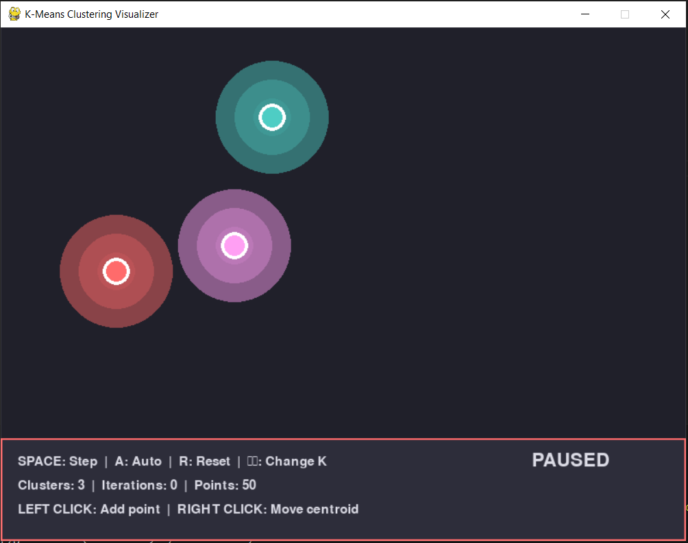

# K-Means Clustering Visualizer 🎮

An interactive, visually stunning Python application that brings the K-Means clustering algorithm to life! Watch data points dynamically form clusters with smooth animations, particle effects, and real-time visualizations.

Perfect for:
- 🎓 Learning how K-Means clustering works
- 🧪 Experimenting with different datasets and parameters
- 🎨 Enjoying beautiful data visualizations
- 📊 Understanding machine learning concepts visually



## ✨ Features

### 🎬 Smooth Animations
- **Centroids glide smoothly** to new positions (no teleporting!)
- **Points transition gracefully** when changing clusters
- **Color blending** during cluster reassignment
- **Scale-pop effects** when points switch clusters

### 🌟 Visual Effects
- ✨ **Glowing, pulsing halos** around centroids
- 💥 **Particle explosions** when points change clusters
- 🌠 **Trailing effects** behind moving points
- 🔗 **Faint connection lines** from points to centroids
- 🎯 **Smooth color transitions** for better visual feedback

### 🎨 Modern Design
- Rich color palette (Coral, Turquoise, Pink, Peach, Lavender)
- Dark theme for better contrast and reduced eye strain
- Clean, intuitive user interface
- Real-time debug panel with performance metrics

### 🎮 Interactive Controls
- Add points by clicking
- Manually move centroids
- Adjust number of clusters (K) on the fly
- Step-by-step or automatic iteration
- Custom point generation (1-500 points)
- Real-time performance monitoring

### 📊 Data Mining Features
- **Inertia/WCSS Calculation**: Real-time Within-Cluster Sum of Squares metric
- **Dataset Presets**: Pre-built datasets (Blobs, Moons, Circles, Random)
- **Convergence Graph**: Visualize inertia decreasing over iterations
- **Elbow Method**: Automatically test K values to find optimal cluster count
- **Voronoi / Decision Regions**: Visualize cluster regions in the plane
- **DBSCAN (Density-Based Clustering)**: Cluster non-linear shapes and detect **noise/outliers** (no K required)
- **Battle Mode (A/B)**: Compare algorithms side-by-side on the same data (K-Means / K-Medoids / DBSCAN)
- **CSV Import/Export**: Load real datasets and export clustered results
- **Advanced Statistics**: Detailed cluster quality metrics (compactness, separation, variance)
- **Cluster Quality Metrics**: Per-cluster analysis with color-coded visualization

## 📋 Requirements

- **Python 3.7+**
- **Pygame** (for graphics and interaction)

## 🚀 Installation

### Step 1: Clone or Download the Repository

```bash
# Using Git
git clone https://github.com/nerkolt/Kmeans_Game.git
cd Kmeans_Game

# Or download and extract the ZIP file
```

### Step 2: Install Python Dependencies

Make sure you have Python installed. Then install Pygame:

```bash
# Using pip
pip install pygame

# Or if you're using pip3
pip3 install pygame

# On some systems, you might need:
python -m pip install pygame
```

#### Recommended (one command)

```bash
python -m pip install -r requirements.txt
```

### Step 3: Verify Installation

```bash
# Check Python version (should be 3.7+)
python --version

# Check Pygame installation
python -c "import pygame; print(pygame.version.ver)"
```

## 🎯 How to Run

Navigate to the project directory and run the main script:

```bash
# From the project root directory
python Scripts/Kmeans_Game_Debug.py

# Or if you're in the Scripts folder
cd Scripts
python Kmeans_Game_Debug.py
```

**Note:** The main file is `Kmeans_Game_Debug.py` which includes all the latest features and optimizations.

## 📦 Build a Windows EXE (Release)

You can create a standalone Windows build using **PyInstaller**.

### Option A (recommended): one-folder build

From the project root:

```bash
build_exe.bat onedir
```

Output: `dist/KmeansGame/KmeansGame.exe`

### Option B: single-file build

```bash
build_exe.bat onefile
```

Output: `dist/KmeansGame.exe`

### Notes / troubleshooting

- The game uses **Tkinter file dialogs** for CSV import/export; in the EXE build the dialogs will open in your current folder (better UX).
- If Windows Defender flags the EXE, prefer the **one-folder** build (it’s usually less problematic than one-file).

## 🧰 Build a Windows Installer (Setup.exe)

If you want a real installer for GitHub Releases (Start Menu shortcut + optional Desktop shortcut + uninstaller), use **Inno Setup**.

### Install Inno Setup

- Option 1: installer from the official Inno Setup website
- Option 2 (recommended): Chocolatey

```powershell
choco install innosetup -y
```

### Build installer (uses your icon + publisher)

```bat
build_exe.bat installer
```

Output:
- `dist-installer/KmeansGame-Setup-<version>.exe`

Details:
- **Publisher**: Nour Ltaief
- **Icon**: `Assets/logo.png` converted to `.ico` during build

### GitHub Actions (automatic Release uploads)

This repo includes a workflow that builds the EXE + installer automatically when you push a version tag:

```bash
git tag v1.0.0
git push origin v1.0.0
```

The workflow will attach these files to the GitHub Release:
- `dist-installer/KmeansGame-Setup-<version>.exe`
- `dist/KmeansGame/KmeansGame.exe`

## 🎮 Controls & Usage

### Keyboard Controls

#### Basic Controls
| Key | Action |
|-----|--------|
| `SPACE` | Run **one step** of the selected algorithm |
| `A` | Toggle **auto-iteration** (runs until convergence) |
| `R` | **Reset** with new random centroids |
| `P` | Open dialog to set number of points (1-500) |
| `K` | Open dialog to set number of clusters (1-10) |
| `↑` / `↓` | Quickly increase/decrease K |
| `D` | Toggle debug panel (top-right) |
| `T` | Toggle **Learning mode** overlay (tutorial/explanations) |
| `TAB` | Next tutorial page (when Learning mode is on) |
| `SHIFT` + `TAB` | Previous tutorial page |
| `C` | Clear all points |
| `5` | Select **K-Means** |
| `6` | Select **K-Medoids** |
| `7` | Select **DBSCAN** |
| `ESC` | Cancel input dialog / Close window |
| `ENTER` | Confirm input in dialog |

#### Data Mining & Analysis Controls
| Key | Action |
|-----|--------|
| `S` | Toggle **advanced stats panel** (cluster quality metrics) |
| `G` | Toggle **convergence graph** (inertia over iterations) |
| `E` | Run **elbow method** (find optimal K) |
| `V` | Toggle **Voronoi / decision regions** |
| `B` | Toggle **battle mode** (A/B split-screen comparison) |
| `I` | **Import CSV** (x,y) |
| `O` | **Export CSV** (x,y + cluster labels; exports both in battle mode) |
| `1` | Generate **Blobs** dataset (well-separated clusters) |
| `2` | Generate **Moons** dataset (crescent-shaped, non-linear) |
| `3` | Generate **Circles** dataset (concentric rings) |
| `4` | Generate **Random** dataset (uniform distribution) |

### Mouse Controls

| Action | Function |
|--------|----------|
| **Left Click** | Add a new data point at mouse position |
| **Right Click** | Move nearest centroid to mouse position |

### Input Dialog System

When you press `P` or `K`:
1. A dialog box appears
2. Type your desired number (digits only)
3. Press `ENTER` to confirm
4. Press `ESC` to cancel

**Example:** Press `P`, type `200`, hit `ENTER` → instantly generate 200 random points!

## 🔧 Debug Panel

Press `D` to toggle the debug overlay (top-right corner). It displays:

- **FPS**: Real-time frame rate
- **Points**: Total number of data points
- **Clusters (K)**: Current number of clusters
- **Iterations**: Number of algorithm iterations performed
- **Particles**: Active particle effects count
- **Converged**: Whether the algorithm has converged
- **Inertia (WCSS)**: Within-Cluster Sum of Squares (lower is better)
- **DBSCAN eps/min_samples**: DBSCAN density parameters (when using DBSCAN)
- **Dataset**: Current dataset type (random/blobs/moons/circles)
- **Cluster Sizes**: Point count per cluster (color-coded)

The panel automatically resizes based on the number of clusters!

## 📊 Data Mining Features

### Inertia (WCSS) Metric

**Inertia** (Within-Cluster Sum of Squares) measures how tightly points are clustered around their centroids. Lower inertia means better clustering!

- Displayed in real-time in the debug panel
- Tracked over iterations for the convergence graph
- Used in the elbow method to find optimal K

### Dataset Presets

Test K-Means on different data distributions:

- **Blobs** (`1`): Well-separated Gaussian clusters - perfect for K-Means
- **Moons** (`2`): Two crescent-shaped clusters - challenges K-Means (non-linear)
- **Circles** (`3`): Concentric ring clusters - another non-linear challenge
- **Random** (`4`): Uniform random distribution - baseline test

**Tip**: Try the Moons dataset with K=2 to see how K-Means struggles with non-linear data!

### Convergence Graph

Press `G` to toggle the convergence graph (top-left corner).

- Shows **inertia decreasing** over iterations
- Visualizes algorithm progress in real-time
- Helps identify when convergence is reached
- Updates automatically as the algorithm runs

**What to look for**: A downward trend that flattens out indicates convergence.

### Elbow Method

Press `E` to run the elbow method analysis (bottom-right corner).

The elbow method helps you find the **optimal number of clusters (K)** by:
1. Testing K values from 1 to 10
2. Calculating inertia for each K
3. Plotting K vs Inertia
4. Finding the "elbow" point where adding more clusters doesn't help much

**How to read it**: Look for the point where the line bends sharply (the "elbow"). That's usually the optimal K!

**Note**: The elbow method may take a few seconds to compute as it runs the algorithm for each K value.

### Advanced Statistics Panel

Press `S` to toggle the advanced statistics panel (left side).

Displays comprehensive cluster quality metrics:

#### Overall Metrics
- **Inertia (WCSS)**: Total within-cluster sum of squares
- **Min Separation**: Distance between closest centroids

#### Per-Cluster Metrics
For each cluster (color-coded):
- **Size**: Number of points in the cluster
- **Avg Distance**: Average distance from points to centroid
- **Compactness**: Measure of how tightly packed the cluster is (higher is better)

**Use cases**:
- Compare cluster quality across different K values
- Identify unbalanced clusters
- Analyze cluster compactness and separation
- Validate clustering results

## 📁 Project Structure

```
Kmeans_Game/
│
├── Scripts/
│   ├── Kmeans_Game_Debug.py      # Main file (recommended - includes all features)
│   ├── Kmeans_Game.py            # Basic version
│   └── Kmeans_Game_Optimization.py  # Optimized version
│
├── Assets/
│   ├── Start.png                 # Screenshot
│   ├── Auto Mode.png             # Screenshot
│   └── 50Points.png              # Screenshot
│
├── README.md                     # This file
├── Tutorial.md                   # Detailed tutorial
└── Visualisation.md              # Visualization guide
```

## ✅ Mini‑project checklist (3DNI Data Mining)

This repository is structured to satisfy the mini‑project constraints in [`file://Enoncé Mini Projet 3DNI.pdf`](file://Enoncé%20Mini%20Projet%203DNI.pdf):

- **At least one data mining algorithm**: K‑Means clustering (+ inertia/WCSS, elbow method, convergence graph).
- **Clear README**: install, dependencies, commands, usage, screenshots.
- **Original work**: interactive “game” visualization + added analysis tools (datasets, metrics, elbow method).

What is **not** part of the repo (submission step):
- **Email submission**: send group names/class + project title + GitHub link to `yassine-net@hotmail.fr` before the deadline.

## 🎓 Understanding K-Means

The K-Means algorithm works in two main steps:

1. **Assignment**: Each point is assigned to the nearest centroid (based on Euclidean distance)
2. **Update**: Centroids move to the mean position of all points in their cluster

These steps repeat until:
- No points change clusters (convergence), or
- Maximum iterations are reached

**Watch the algorithm in action:**
- Points change color when reassigned to a different cluster
- Centroids smoothly move to the center of their clusters
- The algorithm converges when no more changes occur

### Key Concepts

**Inertia (WCSS)**: Measures cluster quality by summing squared distances from points to their centroids. Lower inertia = tighter, better clusters.

**Convergence**: The algorithm stops when no points change clusters between iterations, meaning the clusters are stable.

**Optimal K**: Finding the right number of clusters is crucial. Too few = oversimplified, too many = overfitted. Use the elbow method (`E`) to help!

**Limitations**: K-Means assumes clusters are spherical and similar in size. Try the Moons (`2`) or Circles (`3`) datasets to see where it struggles.

## 🐛 Troubleshooting

### Common Issues

**"ModuleNotFoundError: No module named 'pygame'"**
```bash
# Solution: Install pygame
pip install pygame
```

**"Python not found" or "python: command not found"**
```bash
# Try using python3 instead
python3 Scripts/Kmeans_Game_Debug.py

# Or check if Python is in your PATH
```

**Low FPS or performance issues**
- The code is optimized, but with 500+ points you may see some slowdown
- Try reducing the number of points (press `P` and enter a smaller number)
- Close other applications to free up system resources

**Window doesn't appear**
- Make sure you're running the correct file: `Kmeans_Game_Debug.py`
- Check for error messages in the terminal
- Verify pygame is installed correctly: `python -c "import pygame"`

## 🎨 Customization

You can easily customize the game by editing `Kmeans_Game_Debug.py`:

- **Colors**: Modify the `COLORS` array (lines 15-21)
- **Window Size**: Change `WIDTH` and `HEIGHT` (line 9)
- **FPS**: Adjust `FPS` constant (line 10)
- **Animation Speed**: Modify interpolation values in `Point.update()` and `Centroid.update()`

## 📝 License

This project is open source and available for educational purposes.

## 🤝 Contributing

Contributions are welcome! Feel free to:
- Report bugs
- Suggest new features
- Submit pull requests
- Improve documentation

## 📧 Contact & Support

For questions, issues, or suggestions, please open an issue on the GitHub repository.

---

## 🚀 Quick Start Guide

1. **Run the application**: `python Scripts/Kmeans_Game_Debug.py`
2. **Try a dataset**: Press `1` for blobs, `2` for moons, `3` for circles
3. **Watch it cluster**: Press `A` for auto-mode or `SPACE` to step through
4. **Analyze results**: 
   - Press `G` to see the convergence graph
   - Press `S` to view detailed statistics
   - Press `E` to find optimal K with elbow method
5. **Experiment**: Change K with `↑`/`↓` or `K`, try different datasets, add your own points!

## 💡 Pro Tips

- **Start with Blobs** (`1`) to see K-Means at its best
- **Try Moons** (`2`) with K=2 to see K-Means limitations with non-linear data
- **Use Elbow Method** (`E`) before manually choosing K
- **Watch the Convergence Graph** (`G`) to understand algorithm progress
- **Check Stats Panel** (`S`) to compare cluster quality
- **Lower Inertia = Better Clustering** - watch it decrease as clusters improve!

---

**Enjoy exploring K-Means clustering! 🎉**

*Press `A` to watch the magic happen automatically, or use `SPACE` to step through each iteration manually.*
